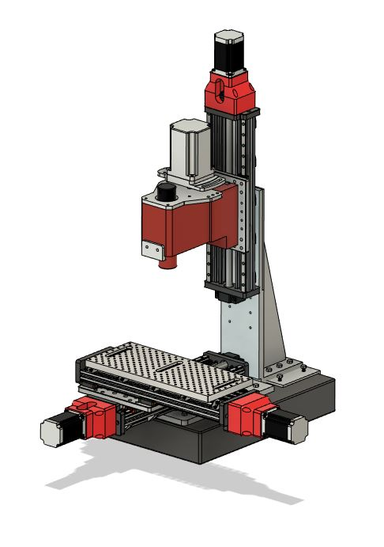

# RIGCNC

Reasonably Inexpensive Granite CNC Machine

Check out the Project write up here: https://Rigcnc.com
or
Join us on Discord https://discord.gg/nUDMupgdbz

I've left the Main Assembly in the Root folder for convenience.

Total project should cost ~$1500. 

The general design intent is to begin the build with 3D printed parts, then use the "finished" mill to machine aluminum upgrade parts.

With an upgraded aluminum build I've been able to easily get ~1.5 Cubic Inches of aluminum per minute material removal rates (Video belo

https://user-images.githubusercontent.com/121590662/210487239-f7b3fa28-bf4f-4ab2-89e1-a921d7b32305.mp4

w)

